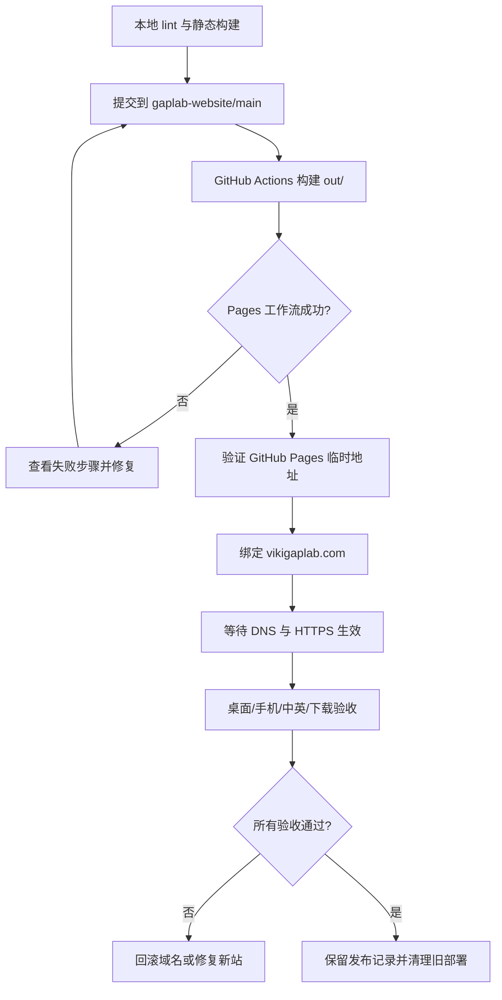

# GapLab 官网部署手册

这份手册记录 GapLab 独立官网从本地构建到 GitHub Pages、自定义域名和最终验收的完整流程。正式站点为 <https://vikigaplab.com>，仓库为 `bubbleviki404/gaplab-website`。

## 安全边界

- 网站源代码、公开图片、演示视频和 GitHub Actions 工作流可以由自动化工具提交。
- GitHub 登录、域名所有权确认、阿里云账号、验证码和任何密码只由用户在官方界面输入。
- GitHub token、DNS 凭据、Apple ID、App 专用密码和 Developer ID 私钥不得写入命令、仓库、截图或日志。
- 新仓库的 Pages 构建和临时访问验证完成前，不删除旧站代码、不关闭旧站部署。
- 域名切换后必须完成 HTTPS、主要页面和下载验证，才能清理旧部署。

## 发布流程图



## 一、首次创建仓库

1. 在 GitHub 新建公开仓库 `gaplab-website`。
2. 初始化 `main` 分支；README 可以由 GitHub 创建，随后会被项目 README 替换。
3. 不在网页中上传密钥、证书或 `.env` 文件。
4. 推送本仓库全部源文件。

成功标志：仓库首页可看到 `app/`、`public/`、`package.json` 和 `.github/workflows/pages.yml`。

## 二、本地发布闸门

在网站根目录执行：

```bash
npm ci
npm run lint
npm run build
```

成功标志：

- ESLint 无错误；
- TypeScript 检查通过；
- Next.js 生成 `/`、`/apps/pictidy/`、`/apps/catchit/`、`/apps/catchit/privacy/`；
- `out/CNAME` 内容为 `vikigaplab.com`；
- `out/pictidy/flow.mp4` 存在。

## 三、启用 GitHub Pages

1. 打开仓库 **Settings → Pages**。
2. 在 **Build and deployment** 中将 Source 设为 **GitHub Actions**。
3. 打开 **Actions**，确认 `Deploy GapLab website` 的 `build` 和 `deploy` 都为绿色。
4. 记录工作流链接和部署时间。

失败时先查看具体步骤：

- `npm ci`：检查 Node.js 版本与 `package-lock.json`；
- `npm run lint`：修复代码问题后重新提交；
- `npm run build`：检查静态导出和资源路径；
- `deploy`：检查 Pages Source、Actions 权限与环境状态。

## 四、迁移自定义域名

1. 新站 Pages 工作流成功后，在新仓库 Pages 设置中填写 `vikigaplab.com`。
2. 不删除阿里云原有 DNS 记录，先核对它们是否已经指向 GitHub Pages。
3. 如果 GitHub 提示域名被旧仓库占用，只解除旧仓库的 Custom domain；旧仓库和代码继续保留。
4. 回到新仓库重新保存域名，等待 DNS Check 成功。
5. DNS 正常后开启 **Enforce HTTPS**。

如需配置根域名，GitHub Pages 常用 A 记录为：

```text
185.199.108.153
185.199.109.153
185.199.110.153
185.199.111.153
```

修改前应以 GitHub Pages 官方文档和仓库 Pages 页面当时显示的要求为准。

## 五、线上验收

逐项验证并记录结果：

- `https://vikigaplab.com/`：GapLab 首页可加载；
- `/apps/pictidy/`：Logo、日历视图、操作页面和演示视频可加载；
- `/apps/catchit/`：最新下载按钮存在；
- `/apps/catchit/privacy/`：隐私说明可访问；
- 中文和英文切换后，导航、标题、正文与按钮语言一致；
- 1440px 桌面、390px 手机宽度没有横向溢出、遮挡或不可点击元素；
- `prefers-reduced-motion` 下演示视频不会强制自动播放；
- CatchIt 下载跳转到 `CatchIt-latest.zip`，下载文件可解压；
- HTTPS 证书有效，无混合内容警告；
- 404 页面不会暴露构建信息或秘密。

## 六、回滚

如果新站部署后出现严重问题：

1. 不删除新仓库提交；保留失败证据。
2. 将域名临时重新绑定旧 Pages 仓库，或恢复上一条已验证提交。
3. 修复后重新运行完整验收，再切换域名。

## 七、截图证据

实际部署时补充以下截图，截图中不得包含 token、账号密码、验证码或 DNS 控制台秘密：

1. `01-repository-ready.png`：独立仓库文件结构；
2. `02-pages-workflow-green.png`：Pages 工作流成功；
3. `03-custom-domain-https.png`：域名检查和 HTTPS；
4. `04-home-desktop.png`：桌面首页；
5. `05-pictidy-mobile.png`：手机 Pictidy 页面；
6. `06-catchit-download.png`：CatchIt 下载验证。

每次发布只保存必要的公开界面截图，并在本节记录日期、提交 SHA 和验证人。
